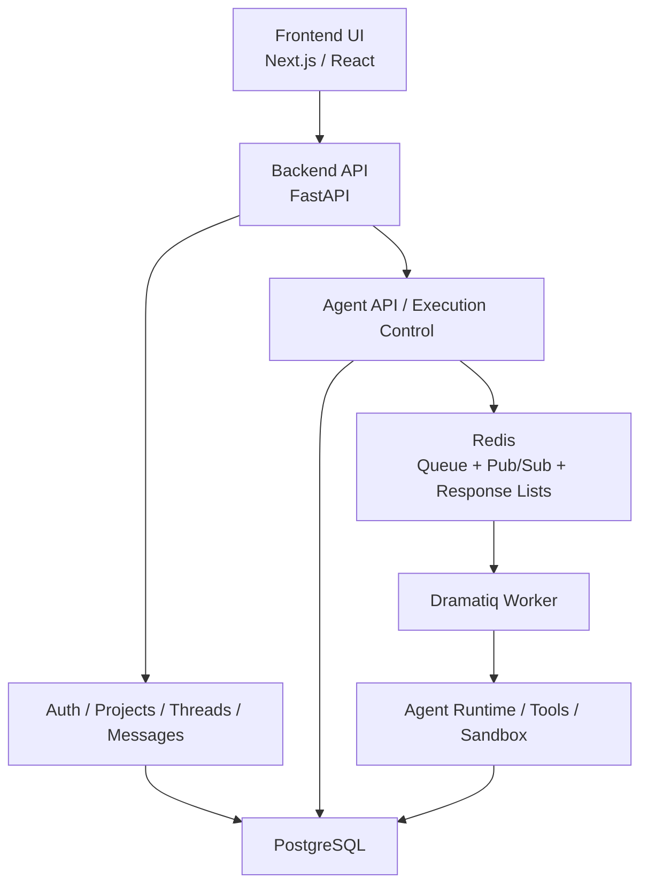
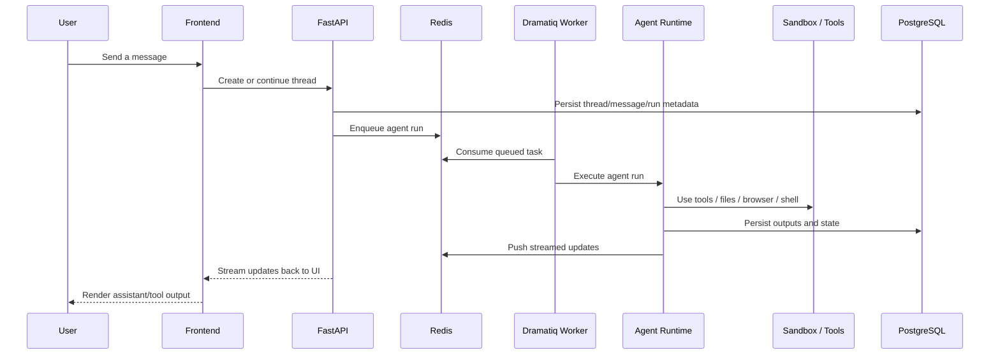
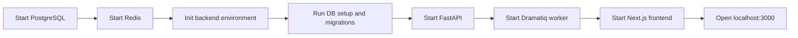

# Hephaestus

[中文 README](README.zh-CN.md)

Hephaestus is a full-stack generalist agent platform organized as a monorepo.
It combines a Next.js frontend, a FastAPI backend, PostgreSQL persistence, Redis-backed async execution, and an agent runtime that can coordinate tools, sandbox operations, and workflow-style tasks.

## What This Repository Contains

- `frontend/`
  Next.js 15 + React 18 application for chat, agent interaction, projects, threads, and tool visualization.
- `backend/`
  FastAPI backend for authentication, project/thread/message management, agent execution, sandbox integration, and worker orchestration.
- `website/`
  Standalone static marketing / product website intended for public-facing landing-page deployment.
- `docs/`
  Setup notes, architecture notes, repository structure notes, and project analysis documents.
- `scripts/`
  PowerShell helper scripts for local Windows development.

## Core Capabilities

- Thread-based conversational agent workflow
- Async agent execution with background workers
- Redis-backed streaming and execution coordination
- PostgreSQL-backed users, projects, threads, messages, and agent runs
- Sandbox-oriented tool execution model
- Frontend tool panels for structured agent/tool output

## Architecture



## Agent Execution Flow



## Local Development Flow



## Repository Layout

```text
Hephaestus/
  backend/
  frontend/
  website/
  docs/
    analysis/
  scripts/
  .env.example
  README.md
  README.zh-CN.md
```

## Quick Start

### 1. Check prerequisites

Required:

- Python 3.11
- Node.js 22 or compatible
- PostgreSQL
- Redis

Optional helper:

```powershell
scripts/check-prereqs.ps1
```

### 2. Configure environment

Root example:

- [`.env.example`](.env.example)

Backend example:

- [`backend/.env.example`](backend/.env.example)

Frontend example:

- [`frontend/env.example`](frontend/env.example)

### 3. Initialize backend

```powershell
cd backend
python -m venv .venv
.venv\Scripts\Activate.ps1
pip install -r requirements.txt
Copy-Item .env.example .env
python scripts/01_setup_database.py
python scripts/02_setup_redis.py
python scripts/03_init_hephaestus_table.py
```

### 4. Start services

Backend API:

```powershell
cd backend
python api.py
```

Background worker:

```powershell
cd backend
dramatiq run_agent_background
```

Frontend:

```powershell
cd frontend
Copy-Item env.example .env.local
npm install
npm run dev
```

Default frontend URL:

```text
http://localhost:3000
```

Website directory:

```text
website/index.html
```

## Helper Scripts

Root scripts:

- `scripts/check-prereqs.ps1`
- `scripts/init-backend.ps1`
- `scripts/dev-backend.ps1`
- `scripts/dev-worker.ps1`
- `scripts/dev-frontend.ps1`
- `scripts/dev-all.ps1`

## Documentation Index

- [Chinese README](README.zh-CN.md)
- [Setup guide](docs/setup.md)
- [Architecture notes](docs/architecture.md)
- [Development notes](docs/development.md)
- [Repository structure](docs/repository.md)
- [Analysis documents](docs/analysis)
- [Website directory](website/README.md)
- [Website deployment workflow](.github/workflows/deploy-website.yml)

## Important Notes

- This repository was normalized from a course/project package and still includes upstream transitional traces.
- Some large directories, such as `backend/adk-python-main/`, are useful for compatibility and study but make the repository heavier than a typical product repo.
- Sample secrets have been replaced with placeholders, but you should still review local environment files carefully before deployment.
- The frontend still contains some compatibility-era code paths related to the earlier architecture.

## Next Cleanup Candidates

- Reduce or isolate heavy vendored content
- Decide whether some upstream compatibility modules should remain in-repo
- Add shared lint/test/dev orchestration at the root level
- Continue simplifying naming and internal module conventions where needed
