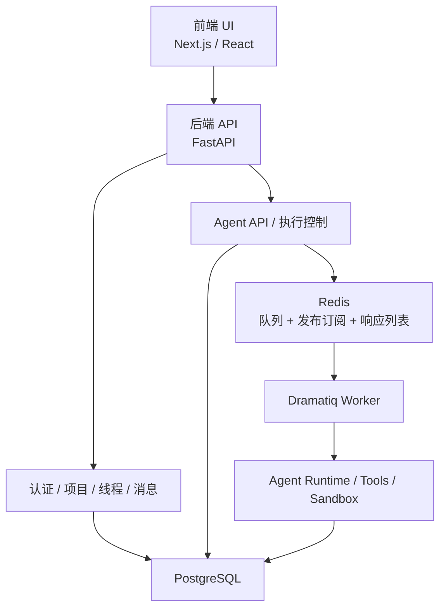
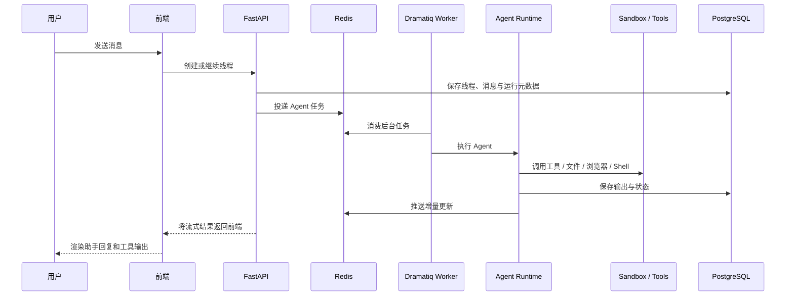
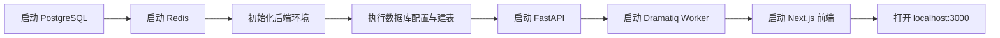

# Hephaestus

[English README](README.md)

Hephaestus 是一个采用 monorepo 组织方式的通用智能体全栈项目。
它整合了 Next.js 前端、FastAPI 后端、PostgreSQL 持久化、Redis 异步协调，以及可驱动工具与沙箱能力的 Agent 运行时。

## 仓库包含的内容

- `frontend/`
  基于 Next.js 15 和 React 18 的前端应用，负责聊天界面、项目与线程管理、Agent 交互、工具结果展示等。
- `backend/`
  基于 FastAPI 的后端服务，负责认证、项目/线程/消息管理、Agent 执行、沙箱接入和后台任务编排。
- `docs/`
  包含安装说明、架构说明、仓库结构说明以及项目分析文档。
- `scripts/`
  面向 Windows 本地开发的 PowerShell 辅助脚本。

## 核心能力

- 基于线程的对话式 Agent 工作流
- 后台 Worker 驱动的异步 Agent 执行
- Redis 驱动的流式输出与执行协调
- PostgreSQL 持久化用户、项目、线程、消息和运行记录
- 面向沙箱的工具执行模型
- 前端提供结构化的工具结果展示面板

## 系统架构



## Agent 运行流程



## 本地开发流程



## 仓库结构

```text
Hephaestus/
  backend/
  frontend/
  docs/
    analysis/
  scripts/
  .env.example
  README.md
  README.zh-CN.md
```

## 快速开始

### 1. 检查依赖

基础依赖：

- Python 3.11
- Node.js 22 或兼容版本
- PostgreSQL
- Redis

可使用辅助脚本：

```powershell
scripts/check-prereqs.ps1
```

### 2. 配置环境变量

根目录示例：

- [`.env.example`](.env.example)

后端示例：

- [`backend/.env.example`](backend/.env.example)

前端示例：

- [`frontend/env.example`](frontend/env.example)

### 3. 初始化后端

```powershell
cd backend
python -m venv .venv
.venv\Scripts\Activate.ps1
pip install -r requirements.txt
Copy-Item .env.example .env
python scripts/01_setup_database.py
python scripts/02_setup_redis.py
python scripts/03_init_hephaestus_table.py
```

### 4. 启动服务

启动后端 API：

```powershell
cd backend
python api.py
```

启动后台 Worker：

```powershell
cd backend
dramatiq run_agent_background
```

启动前端：

```powershell
cd frontend
Copy-Item env.example .env.local
npm install
npm run dev
```

默认访问地址：

```text
http://localhost:3000
```

## 辅助脚本

根目录脚本：

- `scripts/check-prereqs.ps1`
- `scripts/init-backend.ps1`
- `scripts/dev-backend.ps1`
- `scripts/dev-worker.ps1`
- `scripts/dev-frontend.ps1`
- `scripts/dev-all.ps1`

## 文档索引

- [English README](README.md)
- [安装说明](docs/setup.md)
- [架构说明](docs/architecture.md)
- [开发说明](docs/development.md)
- [仓库结构说明](docs/repository.md)
- [分析文档](docs/analysis)

## 重要说明

- 当前仓库是从项目/课程资料中整理出的可协作版本，仍保留了一些上游迁移阶段的痕迹。
- 某些大目录，例如 `backend/adk-python-main/`，对兼容性和学习有帮助，但会让仓库体积明显偏大。
- 示例密钥已经替换为占位符，但正式部署前仍建议仔细检查本地环境变量配置。
- 前端中仍保留少量早期架构兼容阶段的代码路径。

## 后续可继续优化的方向

- 进一步收敛或隔离大体积上游依赖目录
- 评估哪些兼容层模块仍有必要保留在仓库中
- 在根目录补充统一的 lint/test/dev 编排能力
- 继续整理内部命名和模块边界，使整体结构更清晰

