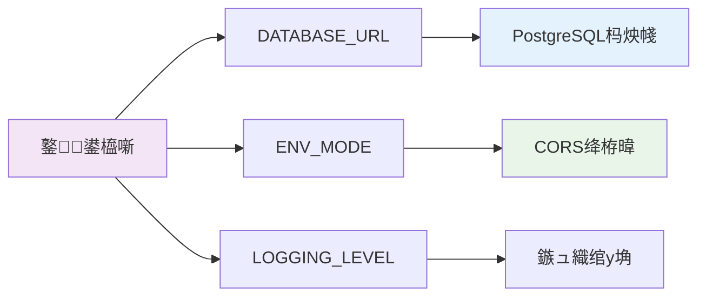

# FastAPI 鏈嶅姟鍒濆鍖栨祦绋嬪浘

鍩轰簬 `api.py` 涓殑 `lifespan` 鍑芥暟鍒嗘瀽鐨勬湇鍔＄敓鍛藉懆鏈熺鐞嗘祦绋嬨€?

## 鏁翠綋鏋舵瀯娴佺▼

```mermaid
flowchart TD
    Start([鏈嶅姟鍚姩]) --> EnvCheck{鐜妫€鏌
    EnvCheck --> |ENV_MODE, DATABASE_URL| InitDB[鍒濆鍖朠ostgreSQL杩炴帴姹燷
    
    InitDB --> CheckDB{鏁版嵁搴撴槸鍚﹀瓨鍦?}
    CheckDB --> |鍚 CreateDB[鍒涘缓鏁版嵁搴揮
    CheckDB --> |鏄瘄 CheckTables[妫€鏌ユ暟鎹簱琛╙
    CreateDB --> CheckTables
    CheckTables --> AutoCreate{琛ㄦ槸鍚︾己澶?}
    AutoCreate --> |鏄瘄 ExecSQL[鎵цhephaestus.sql寤鸿〃]
    AutoCreate --> |鍚 InitRedis[鍒濆鍖朢edis杩炴帴]
    ExecSQL --> InitRedis
    
    InitRedis --> |鍙€夌粍浠秥 InitAgent[鍒濆鍖朅gent API]
    InitAgent --> InitSandbox[鍒濆鍖朣andbox API]
    InitSandbox --> InitTriggers[鍒濆鍖朤riggers API]
    
    InitTriggers --> CommentedAPIs[鍏朵粬API缁勪欢<br/>宸叉敞閲婃帀]
    CommentedAPIs -.-> |pipedream_api| Disabled1[馃挙]
    CommentedAPIs -.-> |credentials_api| Disabled2[馃挙]
    CommentedAPIs -.-> |template_api| Disabled3[馃挙]
    CommentedAPIs -.-> |composio_api| Disabled4[馃挙]
    
    InitTriggers --> Running[馃煝 鏈嶅姟杩愯涓璢
    
    %% 娓呯悊闃舵
    Running --> Shutdown([鏀跺埌鍏抽棴淇″彿])
    Shutdown --> CleanAgent[娓呯悊Agent璧勬簮]
    CleanAgent --> CloseRedis[鍏抽棴Redis杩炴帴]
    CloseRedis --> CloseDB[鏂紑鏁版嵁搴撹繛鎺
    CloseDB --> End([鏈嶅姟鍋滄])
    
    %% 閿欒澶勭悊
    InitDB --> |澶辫触| Error1[鉂?鍚姩澶辫触]
    CheckDB --> |妫€鏌ュけ璐 Error2[鉂?鍚姩澶辫触]
    CreateDB --> |鍒涘缓澶辫触| Error3[鉂?鍚姩澶辫触]
    InitRedis --> |澶辫触| Warn1[鈿狅笍 缁х画鍚姩浣嗚褰曡鍛奭
    InitTriggers --> |澶辫触| Warn2[鈿狅笍 璺宠繃璇ョ粍浠禲
    
    style Start fill:#e1f5fe
    style Running fill:#e8f5e8
    style End fill:#fce4ec
    style Error1 fill:#ffebee
    style Warn1 fill:#fff3e0
    style Warn2 fill:#fff3e0
```

## 鍏抽敭缁勪欢璇存槑

### 馃敡 鏍稿績鍩虹璁炬柦
- **PostgreSQL**: 涓绘暟鎹簱锛屽瓨鍌ㄦ墍鏈変笟鍔℃暟鎹?
  - 鑷姩鍒涘缓鏁版嵁搴擄紙濡備笉瀛樺湪锛?
  - 鍩轰簬 `hephaestus.sql` 鑷姩妫€鏌ュ拰鍒涘缓16涓牳蹇冭〃
- **Redis**: 缂撳瓨鍜屼細璇濆瓨鍌?
- **闆堕厤缃惎鍔?*: 鍏ㄨ嚜鍔ㄦ暟鎹簱鍒濆鍖栵紝鏃犻渶鎵嬪姩寤哄簱寤鸿〃

### 馃幆 涓氬姟缁勪欢
- **Agent API**: 鏍稿績AI浠ｇ悊鏈嶅姟锛岄渶瑕?`db` 鍜?`instance_id`
- **Sandbox API**: 浠ｇ爜鎵ц娌欑洅鐜
- **Triggers API**: 浜嬩欢瑙﹀彂鍣ㄧ郴缁?

### 馃挙 鏆傚仠鐨勭粍浠?
```
pipedream_api      # 宸ヤ綔娴侀泦鎴?
credentials_api    # 鍑瘉绠＄悊  
template_api       # 妯℃澘绯荤粺
composio_api       # Composio闆嗘垚
```

### 馃洝锔?閿欒澶勭悊绛栫暐
- **鏁版嵁搴撹繛鎺ュけ璐?*: 绔嬪嵆缁堟鍚姩
- **Redis杩炴帴澶辫触**: 璁板綍璀﹀憡浣嗙户缁惎鍔?
- **鍙€夌粍浠跺け璐?*: 璺宠繃璇ョ粍浠讹紝涓嶅奖鍝嶆牳蹇冨姛鑳?

## 閰嶇疆渚濊禆



## 鏁版嵁搴撹〃缁撴瀯

浠?`hephaestus.sql` 鑷姩鍒涘缓鐨?6涓牳蹇冭〃锛?

```
鐢ㄦ埛璁よ瘉: users, oauth_providers, user_sessions, refresh_tokens, user_activities
椤圭洰绠＄悊: projects, threads, messages  
浠ｇ悊绯荤粺: agents, agent_versions, agent_workflows, agent_runs
ADK妗嗘灦: app_states, sessions, events, user_states
``` 
