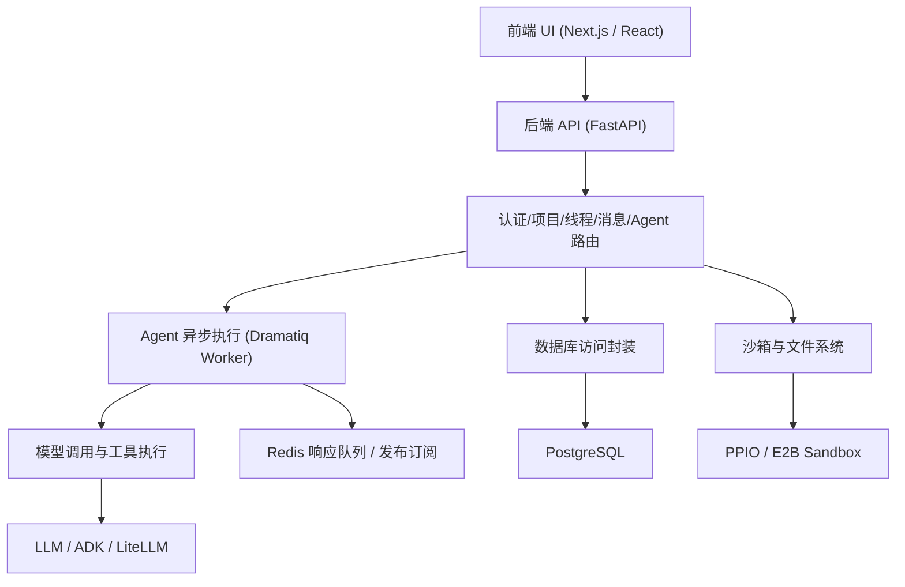
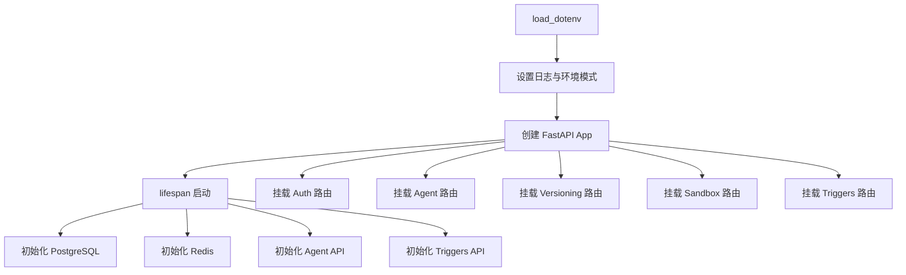
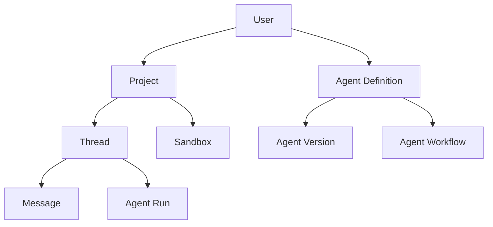
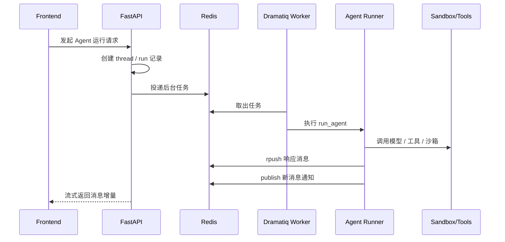

# FuFanManus 源码模块导图与运行链路

## 1. 文档目的

上一份分析报告更偏项目画像，这一份更偏“如何真正读源码”。  
目标是把当前资料里的前端、后端、异步执行、沙箱、初始化脚本，串成一条可跟读的主线。

---

## 2. 建议先建立的整体心智模型

可以先把这个项目理解成 5 层：

1. `UI 层`
2. `业务 API 层`
3. `Agent 运行层`
4. `基础设施层`
5. `初始化与迁移层`

对应关系如下：



---

## 3. 当前资料里真正值得优先读的文件

如果你时间有限，建议优先看下面这些文件：

### 3.1 后端主链路

- `backend/api.py`
- `backend/services/postgresql.py`
- `backend/services/redis.py`
- `backend/auth/api.py`
- `backend/agent/api.py`
- `backend/run_agent_background.py`
- `backend/sandbox/api.py`

### 3.2 初始化与部署

- `backend/scripts/01_setup_database.py`
- `backend/scripts/02_setup_redis.py`
- `backend/scripts/03_init_fufanmanus_table.py`
- `backend/.env.example`

### 3.3 前端主链路

- `frontend/src/app/layout.tsx`
- `frontend/src/app/providers.tsx`
- `frontend/src/lib/api.ts`
- `frontend/src/lib/api-client.ts`
- `frontend/src/hooks/useAgentStream.ts`

### 3.4 聊天与工具展示核心 UI

- `frontend/src/components/thread/chat-input/*`
- `frontend/src/components/thread/content/*`
- `frontend/src/components/thread/tool-views/*`

---

## 4. 后端模块导图

### 4.1 后端启动顺序

`backend/api.py` 是整个后端的主入口。按启动流程，可以把它理解成：



它承担的角色不是“业务逻辑实现者”，而是“总装配器”。

### 4.2 数据库访问层

`backend/services/postgresql.py` 是项目非常关键的一层。  
它做的不是 ORM，而是“伪 Supabase 风格封装”：

- `DBConnection` 负责连接池生命周期
- `PostgreSQLClient` 负责暴露统一入口
- `PostgreSQLTable` 负责链式查询

典型调用风格：

```python
client = await db.client
result = await client.table("projects").select("*").eq("account_id", user_id).execute()
```

这个设计的意义：

- 迁移业务代码时阻力更小
- 上层写法接近 Supabase
- 便于课程讲解“从云服务迁到本地数据库”

它的代价：

- 查询能力是人为维护的
- 调试复杂 SQL 时比直接 ORM 更绕
- 类型与边界校验较弱

### 4.3 Redis 层

`backend/services/redis.py` 不只是普通缓存层，它更重要的角色是“异步 Agent 结果转发通道”。

文件注释里已经明确描述了链路：

1. API 收到请求
2. 创建 Redis keys
3. Agent 每产生一个响应就 `rpush`
4. 同时 `publish` 通知
5. 前端/流式接口据此拿到新消息

这实际上是：

- `list` 负责保存消息序列
- `pub/sub` 负责通知“有新消息了”

因此 Redis 在这个项目里更接近“轻量消息中间层”。

---

## 5. 认证、项目、线程与消息的关系

### 5.1 认证入口

`backend/auth/api.py` 暴露的关键接口包括：

- `POST /auth/register`
- `POST /auth/login`
- `POST /auth/refresh`
- `GET /auth/me`
- `POST /auth/logout`

这一层只负责接口接收与校验，真正的用户逻辑在 service 层。

### 5.2 业务对象关系

从接口和数据库命名可以推断核心实体关系：



最重要的使用路径是：

- 用户拥有多个 `project`
- 每个 `project` 下有多个 `thread`
- 每个 `thread` 包含消息和运行记录
- Agent 运行时通常绑定线程与项目上下文

---

## 6. Agent 模块应该怎么读

### 6.1 `agent/api.py` 的职责

`backend/agent/api.py` 不是一个小文件，它基本上是整个智能体业务中枢。  
它大致承担以下职责：

- 创建线程、消息、运行记录
- 解析 Agent 配置
- 触发后台运行
- 处理上传文件与沙箱关联
- 提供流式输出接口
- 管理 Agent 版本、配置与工具

### 6.2 工具体系

从 `backend/agent/tools/` 可以看到项目想支持的工具面很广：

- 浏览器工具
- computer use
- shell 工具
- 文件工具
- 图片编辑工具
- presentation 工具
- 表格工具
- web dev 工具
- MCP 工具包装器
- task list 工具

这说明项目不是把“工具调用”当作一个抽象概念，而是有明确 UI/后端双侧落地的。

### 6.3 工具注册状态

值得注意的是，`ToolManager` 里目前活跃注册的工具很少，很多工具代码存在，但注册被注释掉了。

这意味着两件事：

- 代码库能力边界大于当前课程实际启用边界
- 课程版本可能是“保守开放一部分能力”，而不是全部放开

所以读源码时不要简单按“文件存在”就判断“功能已完整可用”。

### 6.4 沙箱模板选择逻辑

`agent/api.py` 里有一个很关键的函数：根据上传文件类型推断沙箱模板。

大致策略是：

- Web 文件优先用 `browser`
- 纯代码文件优先用 `code`
- `ipynb` 倾向 `desktop`
- 其他混合类型默认 `desktop`

这说明项目的沙箱不是单一环境，而是“按任务选运行形态”。

---

## 7. Agent 异步执行链路

### 7.1 后台任务入口

`backend/run_agent_background.py` 是异步执行链的关键入口。  
它结合：

- `Dramatiq`
- `RedisBroker`
- `run_agent`
- 线程管理与消息流

来完成真正的 Agent 后台执行。

### 7.2 推荐理解方式

把一次任务执行理解成下面这条链：



### 7.3 这套设计的价值

- 前端不会被长任务阻塞
- 任务中途可以持续回传
- 更适合浏览器、文件、代码执行类重任务
- Worker 可独立扩展

---

## 8. 沙箱与文件系统能力

### 8.1 后端沙箱接口

从 `sandbox/api.py` 的暴露内容看，它至少覆盖：

- 文件上传
- 文件列表
- 文件内容读取
- 路径兼容与异常 URL 修复
- 用户访问校验

这说明沙箱不是“Agent 内部黑箱”，而是已经显式暴露成业务 API。

### 8.2 为什么这层重要

因为这个项目很多能力都依赖沙箱：

- 代码运行
- 文件读写
- 浏览器预览
- VNC 访问
- 前端预览器渲染

因此它其实是“Agent 执行动作层”的底座。

---

## 9. 初始化脚本该怎么看

### 9.1 `01_setup_database.py`

作用：

- 与 PostgreSQL 建立连接
- 在目标数据库不存在时尝试创建
- 测试查询
- 写入 `.env`

这是典型的“课程友好型初始化脚本”，让学员不必手工拼配置。

### 9.2 `02_setup_redis.py`

作用：

- 测试 Redis 连通性
- 执行读写验证
- 把 Redis 配置回写到 `.env`

### 9.3 `03_init_fufanmanus_table.py`

作用：

- 执行 `migrations/fufanmanus.sql`
- 创建核心业务表
- 验证关键表是否存在

脚本里明确点名的核心表包括：

- `users`
- `agents`
- `projects`
- `messages`
- `threads`
- `sessions`
- `events`
- `app_states`
- `user_states`

### 9.4 这三步组合起来意味着什么

这三个脚本其实就是一个最小可运行初始化流程：

1. 配数据库
2. 配 Redis
3. 建表

从教学角度看，这种拆分是合理的；从工程角度看，更适合再收敛成一个统一 bootstrap。

---

## 10. 前端模块导图

### 10.1 最外层入口

`frontend/src/app/layout.tsx` 负责全局装配：

- 字体
- Metadata
- Theme
- 全局 Provider
- Analytics
- PostHog
- Toaster

这是一种标准的 App Router 根布局方式。

### 10.2 Provider 层

`frontend/src/app/providers.tsx` 很关键，它把几个横切能力统一挂上去：

- `AuthProvider`
- `ToolCallsContext`
- `ThemeProvider`
- `ReactQueryProvider`

因此前端运行时的状态核心可以概括为：

- 登录态
- 工具调用共享态
- 服务端请求缓存态

### 10.3 页面分区

从 `src/app` 结构看，项目至少分成三块：

1. `(home)`：首页/营销页
2. `(dashboard)`：实际产品控制台
3. `auth`：认证页

这个结构很像标准 SaaS + AI 应用组合。

---

## 11. 前端数据访问为什么值得重点看

### 11.1 `src/lib/api.ts`

这个文件非常关键，因为它暴露了大量“前端如何理解后端”的真实接口形态。

你能在这里看到：

- project API
- thread API
- message API
- agent run API
- sandbox 相关请求
- workflow 相关请求

它相当于前端侧的“业务协议视图”。

### 11.2 `src/lib/api-client.ts`

这个文件更底层，负责：

- 统一请求封装
- 超时控制
- Authorization 注入
- 错误标准化
- 上传请求处理

它也是一个非常能看出“项目是否处于迁移态”的文件，因为其中仍保留了 Supabase session 获取方式。

---

## 12. 聊天线程与工具展示层怎么读

### 12.1 聊天输入区

`src/components/thread/chat-input/*` 负责：

- 输入框
- 模型选择
- 文件上传
- 配置菜单
- 语音录制
- 已上传文件展示

### 12.2 内容显示区

`src/components/thread/content/*` 负责：

- 线程消息渲染
- 工具流展示
- Skeleton
- Agent Avatar

### 12.3 工具结果展示区

`src/components/thread/tool-views/*` 是前端最体现“Agent 产品化程度”的部分之一。

这里不是简单地把工具输出当纯文本显示，而是按工具类型做定制视图，例如：

- 浏览器工具视图
- 命令执行视图
- 文件操作视图
- 图片查看/编辑视图
- 表格视图
- 任务列表视图
- Web Dev 视图

这意味着项目在前端层面已经具备“把 Agent 行为结构化展示”的意识。

---

## 13. 流式消息链路怎么读

### 13.1 核心文件

`frontend/src/hooks/useAgentStream.ts`

这个 hook 基本决定了聊天体验。

它处理的核心问题包括：

- 启动流式订阅
- 接收 chunk
- 拼装 assistant 文本
- 跟踪 tool call 状态
- 结束时清理连接
- 错误与停止态处理

### 13.2 它的重要性

如果不理解这个 hook，就很难理解：

- 为什么前端能边生成边显示
- 为什么工具执行能显示中间态
- 为什么消息不是等后台全部完成才一次性出现

因此它是前端 Agent 体验的“主心骨”之一。

---

## 14. 一条最实用的读源码路径

如果你的目标是“最快真正看懂系统”，建议按下面顺序读：

1. 读 `backend/api.py`
2. 读 `backend/services/postgresql.py`
3. 读 `backend/auth/api.py`
4. 读 `backend/agent/api.py`
5. 读 `backend/run_agent_background.py`
6. 读 `backend/services/redis.py`
7. 读 `frontend/src/app/providers.tsx`
8. 读 `frontend/src/lib/api.ts`
9. 读 `frontend/src/hooks/useAgentStream.ts`
10. 读 `frontend/src/components/thread/*`

这样读的好处是：

- 先看系统骨架
- 再看数据通路
- 再看用户可见的行为层

---

## 15. 从源码角度看，这个项目最值得学习的地方

### 15.1 真正的“平台化”思路

它不是只有聊天页，而是围绕：

- Agent
- Workflow
- Sandbox
- Versioning
- Tools
- Trigger

构建平台。

### 15.2 从云依赖到本地部署的迁移方式

它非常适合作为案例来学习：

- 如何兼容旧接口
- 如何逐步替换底层依赖
- 如何保留上层业务形态不大改

### 15.3 Agent 前端产品化

大量 `tool-views` 文件说明它关注的不是“模型会不会答”，而是“Agent 行为如何展示给用户”。

---

## 16. 读源码时要特别注意的几个坑

### 16.1 不要把“文件存在”当“功能可用”

很多工具、模块、集成是存在的，但注册或路由可能被注释掉了。

### 16.2 不要把 README 当成当前真实状态

README 有一定参考价值，但实现中仍混有迁移期遗留逻辑。

### 16.3 不要忽略“课程交付包”这一点

当前看到的是阶段性打包结果，不一定是研发主仓的最终形态。

---

## 17. 最后给你的实际建议

如果你下一步准备继续深挖，最值得做的是这三件事：

1. 先把 Part 1 的前后端源码真实解压出来，建立可搜索、可跳转、可运行的目录。
2. 先跑通最小链路：注册 -> 创建线程 -> 发起 Agent -> 接收流式消息。
3. 再选一个能力纵向打穿：比如 `文件上传 -> 选择沙箱模板 -> 工具执行 -> 前端展示`。

这样你会比单纯“翻文件”更快建立整体理解。

---

## 18. 本文档的定位

这份文档适合在你真正开始读代码前先看一遍。  
它不是替代源码，而是帮你决定“先看哪几个文件、按什么顺序看、每个模块在系统里到底扮演什么角色”。
