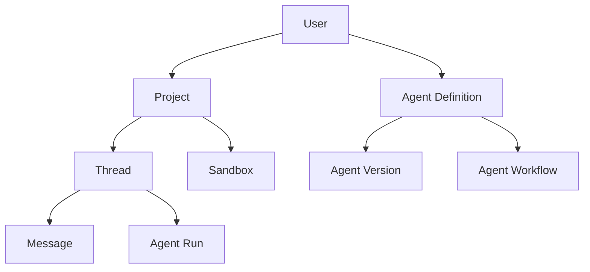
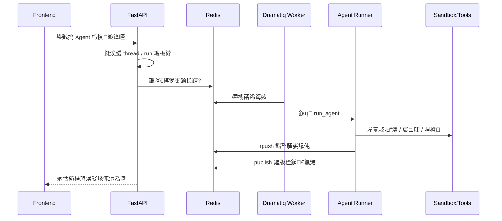

# Hephaestus 婧愮爜妯″潡瀵煎浘涓庤繍琛岄摼璺?

## 1. 鏂囨。鐩殑

涓婁竴浠藉垎鏋愭姤鍛婃洿鍋忛」鐩敾鍍忥紝杩欎竴浠芥洿鍋忊€滃浣曠湡姝ｈ婧愮爜鈥濄€? 
鐩爣鏄妸褰撳墠璧勬枡閲岀殑鍓嶇銆佸悗绔€佸紓姝ユ墽琛屻€佹矙绠便€佸垵濮嬪寲鑴氭湰锛屼覆鎴愪竴鏉″彲璺熻鐨勪富绾裤€?

---

## 2. 寤鸿鍏堝缓绔嬬殑鏁翠綋蹇冩櫤妯″瀷

鍙互鍏堟妸杩欎釜椤圭洰鐞嗚В鎴?5 灞傦細

1. `UI 灞俙
2. `涓氬姟 API 灞俙
3. `Agent 杩愯灞俙
4. `鍩虹璁炬柦灞俙
5. `鍒濆鍖栦笌杩佺Щ灞俙

瀵瑰簲鍏崇郴濡備笅锛?

```mermaid
flowchart TD
    A["鍓嶇 UI (Next.js / React)"] --> B["鍚庣 API (FastAPI)"]
    B --> C["璁よ瘉/椤圭洰/绾跨▼/娑堟伅/Agent 璺敱"]
    C --> D["Agent 寮傛鎵ц (Dramatiq Worker)"]
    C --> E["娌欑涓庢枃浠剁郴缁?]
    C --> F["鏁版嵁搴撹闂皝瑁?]
    D --> G["妯″瀷璋冪敤涓庡伐鍏锋墽琛?]
    D --> H["Redis 鍝嶅簲闃熷垪 / 鍙戝竷璁㈤槄"]
    F --> I["PostgreSQL"]
    E --> J["PPIO / E2B Sandbox"]
    G --> K["LLM / ADK / LiteLLM"]
```

---

## 3. 褰撳墠璧勬枡閲岀湡姝ｅ€煎緱浼樺厛璇荤殑鏂囦欢

濡傛灉浣犳椂闂存湁闄愶紝寤鸿浼樺厛鐪嬩笅闈㈣繖浜涙枃浠讹細

### 3.1 鍚庣涓婚摼璺?

- `backend/api.py`
- `backend/services/postgresql.py`
- `backend/services/redis.py`
- `backend/auth/api.py`
- `backend/agent/api.py`
- `backend/run_agent_background.py`
- `backend/sandbox/api.py`

### 3.2 鍒濆鍖栦笌閮ㄧ讲

- `backend/scripts/01_setup_database.py`
- `backend/scripts/02_setup_redis.py`
- `backend/scripts/03_init_hephaestus_table.py`
- `backend/.env.example`

### 3.3 鍓嶇涓婚摼璺?

- `frontend/src/app/layout.tsx`
- `frontend/src/app/providers.tsx`
- `frontend/src/lib/api.ts`
- `frontend/src/lib/api-client.ts`
- `frontend/src/hooks/useAgentStream.ts`

### 3.4 鑱婂ぉ涓庡伐鍏峰睍绀烘牳蹇?UI

- `frontend/src/components/thread/chat-input/*`
- `frontend/src/components/thread/content/*`
- `frontend/src/components/thread/tool-views/*`

---

## 4. 鍚庣妯″潡瀵煎浘

### 4.1 鍚庣鍚姩椤哄簭

`backend/api.py` 鏄暣涓悗绔殑涓诲叆鍙ｃ€傛寜鍚姩娴佺▼锛屽彲浠ユ妸瀹冪悊瑙ｆ垚锛?

```mermaid
flowchart TD
    A["load_dotenv"] --> B["璁剧疆鏃ュ織涓庣幆澧冩ā寮?]
    B --> C["鍒涘缓 FastAPI App"]
    C --> D["lifespan 鍚姩"]
    D --> E["鍒濆鍖?PostgreSQL"]
    D --> F["鍒濆鍖?Redis"]
    D --> G["鍒濆鍖?Agent API"]
    D --> H["鍒濆鍖?Triggers API"]
    C --> I["鎸傝浇 Auth 璺敱"]
    C --> J["鎸傝浇 Agent 璺敱"]
    C --> K["鎸傝浇 Versioning 璺敱"]
    C --> L["鎸傝浇 Sandbox 璺敱"]
    C --> M["鎸傝浇 Triggers 璺敱"]
```

瀹冩壙鎷呯殑瑙掕壊涓嶆槸鈥滀笟鍔￠€昏緫瀹炵幇鑰呪€濓紝鑰屾槸鈥滄€昏閰嶅櫒鈥濄€?

### 4.2 鏁版嵁搴撹闂眰

`backend/services/postgresql.py` 鏄」鐩潪甯稿叧閿殑涓€灞傘€? 
瀹冨仛鐨勪笉鏄?ORM锛岃€屾槸鈥滀吉 Supabase 椋庢牸灏佽鈥濓細

- `DBConnection` 璐熻矗杩炴帴姹犵敓鍛藉懆鏈?
- `PostgreSQLClient` 璐熻矗鏆撮湶缁熶竴鍏ュ彛
- `PostgreSQLTable` 璐熻矗閾惧紡鏌ヨ

鍏稿瀷璋冪敤椋庢牸锛?

```python
client = await db.client
result = await client.table("projects").select("*").eq("account_id", user_id).execute()
```

杩欎釜璁捐鐨勬剰涔夛細

- 杩佺Щ涓氬姟浠ｇ爜鏃堕樆鍔涙洿灏?
- 涓婂眰鍐欐硶鎺ヨ繎 Supabase
- 渚夸簬璇剧▼璁茶В鈥滀粠浜戞湇鍔¤縼鍒版湰鍦版暟鎹簱鈥?

瀹冪殑浠ｄ环锛?

- 鏌ヨ鑳藉姏鏄汉涓虹淮鎶ょ殑
- 璋冭瘯澶嶆潅 SQL 鏃舵瘮鐩存帴 ORM 鏇寸粫
- 绫诲瀷涓庤竟鐣屾牎楠岃緝寮?

### 4.3 Redis 灞?

`backend/services/redis.py` 涓嶅彧鏄櫘閫氱紦瀛樺眰锛屽畠鏇撮噸瑕佺殑瑙掕壊鏄€滃紓姝?Agent 缁撴灉杞彂閫氶亾鈥濄€?

鏂囦欢娉ㄩ噴閲屽凡缁忔槑纭弿杩颁簡閾捐矾锛?

1. API 鏀跺埌璇锋眰
2. 鍒涘缓 Redis keys
3. Agent 姣忎骇鐢熶竴涓搷搴斿氨 `rpush`
4. 鍚屾椂 `publish` 閫氱煡
5. 鍓嶇/娴佸紡鎺ュ彛鎹鎷垮埌鏂版秷鎭?

杩欏疄闄呬笂鏄細

- `list` 璐熻矗淇濆瓨娑堟伅搴忓垪
- `pub/sub` 璐熻矗閫氱煡鈥滄湁鏂版秷鎭簡鈥?

鍥犳 Redis 鍦ㄨ繖涓」鐩噷鏇存帴杩戔€滆交閲忔秷鎭腑闂村眰鈥濄€?

---

## 5. 璁よ瘉銆侀」鐩€佺嚎绋嬩笌娑堟伅鐨勫叧绯?

### 5.1 璁よ瘉鍏ュ彛

`backend/auth/api.py` 鏆撮湶鐨勫叧閿帴鍙ｅ寘鎷細

- `POST /auth/register`
- `POST /auth/login`
- `POST /auth/refresh`
- `GET /auth/me`
- `POST /auth/logout`

杩欎竴灞傚彧璐熻矗鎺ュ彛鎺ユ敹涓庢牎楠岋紝鐪熸鐨勭敤鎴烽€昏緫鍦?service 灞傘€?

### 5.2 涓氬姟瀵硅薄鍏崇郴

浠庢帴鍙ｅ拰鏁版嵁搴撳懡鍚嶅彲浠ユ帹鏂牳蹇冨疄浣撳叧绯伙細



鏈€閲嶈鐨勪娇鐢ㄨ矾寰勬槸锛?

- 鐢ㄦ埛鎷ユ湁澶氫釜 `project`
- 姣忎釜 `project` 涓嬫湁澶氫釜 `thread`
- 姣忎釜 `thread` 鍖呭惈娑堟伅鍜岃繍琛岃褰?
- Agent 杩愯鏃堕€氬父缁戝畾绾跨▼涓庨」鐩笂涓嬫枃

---

## 6. Agent 妯″潡搴旇鎬庝箞璇?

### 6.1 `agent/api.py` 鐨勮亴璐?

`backend/agent/api.py` 涓嶆槸涓€涓皬鏂囦欢锛屽畠鍩烘湰涓婃槸鏁翠釜鏅鸿兘浣撲笟鍔′腑鏋€? 
瀹冨ぇ鑷存壙鎷呬互涓嬭亴璐ｏ細

- 鍒涘缓绾跨▼銆佹秷鎭€佽繍琛岃褰?
- 瑙ｆ瀽 Agent 閰嶇疆
- 瑙﹀彂鍚庡彴杩愯
- 澶勭悊涓婁紶鏂囦欢涓庢矙绠卞叧鑱?
- 鎻愪緵娴佸紡杈撳嚭鎺ュ彛
- 绠＄悊 Agent 鐗堟湰銆侀厤缃笌宸ュ叿

### 6.2 宸ュ叿浣撶郴

浠?`backend/agent/tools/` 鍙互鐪嬪埌椤圭洰鎯虫敮鎸佺殑宸ュ叿闈㈠緢骞匡細

- 娴忚鍣ㄥ伐鍏?
- computer use
- shell 宸ュ叿
- 鏂囦欢宸ュ叿
- 鍥剧墖缂栬緫宸ュ叿
- presentation 宸ュ叿
- 琛ㄦ牸宸ュ叿
- web dev 宸ュ叿
- MCP 宸ュ叿鍖呰鍣?
- task list 宸ュ叿

杩欒鏄庨」鐩笉鏄妸鈥滃伐鍏疯皟鐢ㄢ€濆綋浣滀竴涓娊璞℃蹇碉紝鑰屾槸鏈夋槑纭?UI/鍚庣鍙屼晶钀藉湴鐨勩€?

### 6.3 宸ュ叿娉ㄥ唽鐘舵€?

鍊煎緱娉ㄦ剰鐨勬槸锛宍ToolManager` 閲岀洰鍓嶆椿璺冩敞鍐岀殑宸ュ叿寰堝皯锛屽緢澶氬伐鍏蜂唬鐮佸瓨鍦紝浣嗘敞鍐岃娉ㄩ噴鎺変簡銆?

杩欐剰鍛崇潃涓や欢浜嬶細

- 浠ｇ爜搴撹兘鍔涜竟鐣屽ぇ浜庡綋鍓嶈绋嬪疄闄呭惎鐢ㄨ竟鐣?
- 璇剧▼鐗堟湰鍙兘鏄€滀繚瀹堝紑鏀句竴閮ㄥ垎鑳藉姏鈥濓紝鑰屼笉鏄叏閮ㄦ斁寮€

鎵€浠ヨ婧愮爜鏃朵笉瑕佺畝鍗曟寜鈥滄枃浠跺瓨鍦ㄢ€濆氨鍒ゆ柇鈥滃姛鑳藉凡瀹屾暣鍙敤鈥濄€?

### 6.4 娌欑妯℃澘閫夋嫨閫昏緫

`agent/api.py` 閲屾湁涓€涓緢鍏抽敭鐨勫嚱鏁帮細鏍规嵁涓婁紶鏂囦欢绫诲瀷鎺ㄦ柇娌欑妯℃澘銆?

澶ц嚧绛栫暐鏄細

- Web 鏂囦欢浼樺厛鐢?`browser`
- 绾唬鐮佹枃浠朵紭鍏堢敤 `code`
- `ipynb` 鍊惧悜 `desktop`
- 鍏朵粬娣峰悎绫诲瀷榛樿 `desktop`

杩欒鏄庨」鐩殑娌欑涓嶆槸鍗曚竴鐜锛岃€屾槸鈥滄寜浠诲姟閫夎繍琛屽舰鎬佲€濄€?

---

## 7. Agent 寮傛鎵ц閾捐矾

### 7.1 鍚庡彴浠诲姟鍏ュ彛

`backend/run_agent_background.py` 鏄紓姝ユ墽琛岄摼鐨勫叧閿叆鍙ｃ€? 
瀹冪粨鍚堬細

- `Dramatiq`
- `RedisBroker`
- `run_agent`
- 绾跨▼绠＄悊涓庢秷鎭祦

鏉ュ畬鎴愮湡姝ｇ殑 Agent 鍚庡彴鎵ц銆?

### 7.2 鎺ㄨ崘鐞嗚В鏂瑰紡

鎶婁竴娆′换鍔℃墽琛岀悊瑙ｆ垚涓嬮潰杩欐潯閾撅細



### 7.3 杩欏璁捐鐨勪环鍊?

- 鍓嶇涓嶄細琚暱浠诲姟闃诲
- 浠诲姟涓€斿彲浠ユ寔缁洖浼?
- 鏇撮€傚悎娴忚鍣ㄣ€佹枃浠躲€佷唬鐮佹墽琛岀被閲嶄换鍔?
- Worker 鍙嫭绔嬫墿灞?

---

## 8. 娌欑涓庢枃浠剁郴缁熻兘鍔?

### 8.1 鍚庣娌欑鎺ュ彛

浠?`sandbox/api.py` 鐨勬毚闇插唴瀹圭湅锛屽畠鑷冲皯瑕嗙洊锛?

- 鏂囦欢涓婁紶
- 鏂囦欢鍒楄〃
- 鏂囦欢鍐呭璇诲彇
- 璺緞鍏煎涓庡紓甯?URL 淇
- 鐢ㄦ埛璁块棶鏍￠獙

杩欒鏄庢矙绠变笉鏄€淎gent 鍐呴儴榛戠鈥濓紝鑰屾槸宸茬粡鏄惧紡鏆撮湶鎴愪笟鍔?API銆?

### 8.2 涓轰粈涔堣繖灞傞噸瑕?

鍥犱负杩欎釜椤圭洰寰堝鑳藉姏閮戒緷璧栨矙绠憋細

- 浠ｇ爜杩愯
- 鏂囦欢璇诲啓
- 娴忚鍣ㄩ瑙?
- VNC 璁块棶
- 鍓嶇棰勮鍣ㄦ覆鏌?

鍥犳瀹冨叾瀹炴槸鈥淎gent 鎵ц鍔ㄤ綔灞傗€濈殑搴曞骇銆?

---

## 9. 鍒濆鍖栬剼鏈鎬庝箞鐪?

### 9.1 `01_setup_database.py`

浣滅敤锛?

- 涓?PostgreSQL 寤虹珛杩炴帴
- 鍦ㄧ洰鏍囨暟鎹簱涓嶅瓨鍦ㄦ椂灏濊瘯鍒涘缓
- 娴嬭瘯鏌ヨ
- 鍐欏叆 `.env`

杩欐槸鍏稿瀷鐨勨€滆绋嬪弸濂藉瀷鍒濆鍖栬剼鏈€濓紝璁╁鍛樹笉蹇呮墜宸ユ嫾閰嶇疆銆?

### 9.2 `02_setup_redis.py`

浣滅敤锛?

- 娴嬭瘯 Redis 杩為€氭€?
- 鎵ц璇诲啓楠岃瘉
- 鎶?Redis 閰嶇疆鍥炲啓鍒?`.env`

### 9.3 `03_init_hephaestus_table.py`

浣滅敤锛?

- 鎵ц `migrations/hephaestus.sql`
- 鍒涘缓鏍稿績涓氬姟琛?
- 楠岃瘉鍏抽敭琛ㄦ槸鍚﹀瓨鍦?

鑴氭湰閲屾槑纭偣鍚嶇殑鏍稿績琛ㄥ寘鎷細

- `users`
- `agents`
- `projects`
- `messages`
- `threads`
- `sessions`
- `events`
- `app_states`
- `user_states`

### 9.4 杩欎笁姝ョ粍鍚堣捣鏉ユ剰鍛崇潃浠€涔?

杩欎笁涓剼鏈叾瀹炲氨鏄竴涓渶灏忓彲杩愯鍒濆鍖栨祦绋嬶細

1. 閰嶆暟鎹簱
2. 閰?Redis
3. 寤鸿〃

浠庢暀瀛﹁搴︾湅锛岃繖绉嶆媶鍒嗘槸鍚堢悊鐨勶紱浠庡伐绋嬭搴︾湅锛屾洿閫傚悎鍐嶆敹鏁涙垚涓€涓粺涓€ bootstrap銆?

---

## 10. 鍓嶇妯″潡瀵煎浘

### 10.1 鏈€澶栧眰鍏ュ彛

`frontend/src/app/layout.tsx` 璐熻矗鍏ㄥ眬瑁呴厤锛?

- 瀛椾綋
- Metadata
- Theme
- 鍏ㄥ眬 Provider
- Analytics
- PostHog
- Toaster

杩欐槸涓€绉嶆爣鍑嗙殑 App Router 鏍瑰竷灞€鏂瑰紡銆?

### 10.2 Provider 灞?

`frontend/src/app/providers.tsx` 寰堝叧閿紝瀹冩妸鍑犱釜妯垏鑳藉姏缁熶竴鎸備笂鍘伙細

- `AuthProvider`
- `ToolCallsContext`
- `ThemeProvider`
- `ReactQueryProvider`

鍥犳鍓嶇杩愯鏃剁殑鐘舵€佹牳蹇冨彲浠ユ鎷负锛?

- 鐧诲綍鎬?
- 宸ュ叿璋冪敤鍏变韩鎬?
- 鏈嶅姟绔姹傜紦瀛樻€?

### 10.3 椤甸潰鍒嗗尯

浠?`src/app` 缁撴瀯鐪嬶紝椤圭洰鑷冲皯鍒嗘垚涓夊潡锛?

1. `(home)`锛氶椤?钀ラ攢椤?
2. `(dashboard)`锛氬疄闄呬骇鍝佹帶鍒跺彴
3. `auth`锛氳璇侀〉

杩欎釜缁撴瀯寰堝儚鏍囧噯 SaaS + AI 搴旂敤缁勫悎銆?

---

## 11. 鍓嶇鏁版嵁璁块棶涓轰粈涔堝€煎緱閲嶇偣鐪?

### 11.1 `src/lib/api.ts`

杩欎釜鏂囦欢闈炲父鍏抽敭锛屽洜涓哄畠鏆撮湶浜嗗ぇ閲忊€滃墠绔浣曠悊瑙ｅ悗绔€濈殑鐪熷疄鎺ュ彛褰㈡€併€?

浣犺兘鍦ㄨ繖閲岀湅鍒帮細

- project API
- thread API
- message API
- agent run API
- sandbox 鐩稿叧璇锋眰
- workflow 鐩稿叧璇锋眰

瀹冪浉褰撲簬鍓嶇渚х殑鈥滀笟鍔″崗璁鍥锯€濄€?

### 11.2 `src/lib/api-client.ts`

杩欎釜鏂囦欢鏇村簳灞傦紝璐熻矗锛?

- 缁熶竴璇锋眰灏佽
- 瓒呮椂鎺у埗
- Authorization 娉ㄥ叆
- 閿欒鏍囧噯鍖?
- 涓婁紶璇锋眰澶勭悊

瀹冧篃鏄竴涓潪甯歌兘鐪嬪嚭鈥滈」鐩槸鍚﹀浜庤縼绉绘€佲€濈殑鏂囦欢锛屽洜涓哄叾涓粛淇濈暀浜?Supabase session 鑾峰彇鏂瑰紡銆?

---

## 12. 鑱婂ぉ绾跨▼涓庡伐鍏峰睍绀哄眰鎬庝箞璇?

### 12.1 鑱婂ぉ杈撳叆鍖?

`src/components/thread/chat-input/*` 璐熻矗锛?

- 杈撳叆妗?
- 妯″瀷閫夋嫨
- 鏂囦欢涓婁紶
- 閰嶇疆鑿滃崟
- 璇煶褰曞埗
- 宸蹭笂浼犳枃浠跺睍绀?

### 12.2 鍐呭鏄剧ず鍖?

`src/components/thread/content/*` 璐熻矗锛?

- 绾跨▼娑堟伅娓叉煋
- 宸ュ叿娴佸睍绀?
- Skeleton
- Agent Avatar

### 12.3 宸ュ叿缁撴灉灞曠ず鍖?

`src/components/thread/tool-views/*` 鏄墠绔渶浣撶幇鈥淎gent 浜у搧鍖栫▼搴︹€濈殑閮ㄥ垎涔嬩竴銆?

杩欓噷涓嶆槸绠€鍗曞湴鎶婂伐鍏疯緭鍑哄綋绾枃鏈樉绀猴紝鑰屾槸鎸夊伐鍏风被鍨嬪仛瀹氬埗瑙嗗浘锛屼緥濡傦細

- 娴忚鍣ㄥ伐鍏疯鍥?
- 鍛戒护鎵ц瑙嗗浘
- 鏂囦欢鎿嶄綔瑙嗗浘
- 鍥剧墖鏌ョ湅/缂栬緫瑙嗗浘
- 琛ㄦ牸瑙嗗浘
- 浠诲姟鍒楄〃瑙嗗浘
- Web Dev 瑙嗗浘

杩欐剰鍛崇潃椤圭洰鍦ㄥ墠绔眰闈㈠凡缁忓叿澶団€滄妸 Agent 琛屼负缁撴瀯鍖栧睍绀衡€濈殑鎰忚瘑銆?

---

## 13. 娴佸紡娑堟伅閾捐矾鎬庝箞璇?

### 13.1 鏍稿績鏂囦欢

`frontend/src/hooks/useAgentStream.ts`

杩欎釜 hook 鍩烘湰鍐冲畾浜嗚亰澶╀綋楠屻€?

瀹冨鐞嗙殑鏍稿績闂鍖呮嫭锛?

- 鍚姩娴佸紡璁㈤槄
- 鎺ユ敹 chunk
- 鎷艰 assistant 鏂囨湰
- 璺熻釜 tool call 鐘舵€?
- 缁撴潫鏃舵竻鐞嗚繛鎺?
- 閿欒涓庡仠姝㈡€佸鐞?

### 13.2 瀹冪殑閲嶈鎬?

濡傛灉涓嶇悊瑙ｈ繖涓?hook锛屽氨寰堥毦鐞嗚В锛?

- 涓轰粈涔堝墠绔兘杈圭敓鎴愯竟鏄剧ず
- 涓轰粈涔堝伐鍏锋墽琛岃兘鏄剧ず涓棿鎬?
- 涓轰粈涔堟秷鎭笉鏄瓑鍚庡彴鍏ㄩ儴瀹屾垚鎵嶄竴娆℃€у嚭鐜?

鍥犳瀹冩槸鍓嶇 Agent 浣撻獙鐨勨€滀富蹇冮鈥濅箣涓€銆?

---

## 14. 涓€鏉℃渶瀹炵敤鐨勮婧愮爜璺緞

濡傛灉浣犵殑鐩爣鏄€滄渶蹇湡姝ｇ湅鎳傜郴缁熲€濓紝寤鸿鎸変笅闈㈤『搴忚锛?

1. 璇?`backend/api.py`
2. 璇?`backend/services/postgresql.py`
3. 璇?`backend/auth/api.py`
4. 璇?`backend/agent/api.py`
5. 璇?`backend/run_agent_background.py`
6. 璇?`backend/services/redis.py`
7. 璇?`frontend/src/app/providers.tsx`
8. 璇?`frontend/src/lib/api.ts`
9. 璇?`frontend/src/hooks/useAgentStream.ts`
10. 璇?`frontend/src/components/thread/*`

杩欐牱璇荤殑濂藉鏄細

- 鍏堢湅绯荤粺楠ㄦ灦
- 鍐嶇湅鏁版嵁閫氳矾
- 鍐嶇湅鐢ㄦ埛鍙鐨勮涓哄眰

---

## 15. 浠庢簮鐮佽搴︾湅锛岃繖涓」鐩渶鍊煎緱瀛︿範鐨勫湴鏂?

### 15.1 鐪熸鐨勨€滃钩鍙板寲鈥濇€濊矾

瀹冧笉鏄彧鏈夎亰澶╅〉锛岃€屾槸鍥寸粫锛?

- Agent
- Workflow
- Sandbox
- Versioning
- Tools
- Trigger

鏋勫缓骞冲彴銆?

### 15.2 浠庝簯渚濊禆鍒版湰鍦伴儴缃茬殑杩佺Щ鏂瑰紡

瀹冮潪甯搁€傚悎浣滀负妗堜緥鏉ュ涔狅細

- 濡備綍鍏煎鏃ф帴鍙?
- 濡備綍閫愭鏇挎崲搴曞眰渚濊禆
- 濡備綍淇濈暀涓婂眰涓氬姟褰㈡€佷笉澶ф敼

### 15.3 Agent 鍓嶇浜у搧鍖?

澶ч噺 `tool-views` 鏂囦欢璇存槑瀹冨叧娉ㄧ殑涓嶆槸鈥滄ā鍨嬩細涓嶄細绛斺€濓紝鑰屾槸鈥淎gent 琛屼负濡備綍灞曠ず缁欑敤鎴封€濄€?

---

## 16. 璇绘簮鐮佹椂瑕佺壒鍒敞鎰忕殑鍑犱釜鍧?

### 16.1 涓嶈鎶娾€滄枃浠跺瓨鍦ㄢ€濆綋鈥滃姛鑳藉彲鐢ㄢ€?

寰堝宸ュ叿銆佹ā鍧椼€侀泦鎴愭槸瀛樺湪鐨勶紝浣嗘敞鍐屾垨璺敱鍙兘琚敞閲婃帀浜嗐€?

### 16.2 涓嶈鎶?README 褰撴垚褰撳墠鐪熷疄鐘舵€?

README 鏈変竴瀹氬弬鑰冧环鍊硷紝浣嗗疄鐜颁腑浠嶆贩鏈夎縼绉绘湡閬楃暀閫昏緫銆?

### 16.3 涓嶈蹇界暐鈥滆绋嬩氦浠樺寘鈥濊繖涓€鐐?

褰撳墠鐪嬪埌鐨勬槸闃舵鎬ф墦鍖呯粨鏋滐紝涓嶄竴瀹氭槸鐮斿彂涓讳粨鐨勬渶缁堝舰鎬併€?

---

## 17. 鏈€鍚庣粰浣犵殑瀹為檯寤鸿

濡傛灉浣犱笅涓€姝ュ噯澶囩户缁繁鎸栵紝鏈€鍊煎緱鍋氱殑鏄繖涓変欢浜嬶細

1. 鍏堟妸 Part 1 鐨勫墠鍚庣婧愮爜鐪熷疄瑙ｅ帇鍑烘潵锛屽缓绔嬪彲鎼滅储銆佸彲璺宠浆銆佸彲杩愯鐨勭洰褰曘€?
2. 鍏堣窇閫氭渶灏忛摼璺細娉ㄥ唽 -> 鍒涘缓绾跨▼ -> 鍙戣捣 Agent -> 鎺ユ敹娴佸紡娑堟伅銆?
3. 鍐嶉€変竴涓兘鍔涚旱鍚戞墦绌匡細姣斿 `鏂囦欢涓婁紶 -> 閫夋嫨娌欑妯℃澘 -> 宸ュ叿鎵ц -> 鍓嶇灞曠ず`銆?

杩欐牱浣犱細姣斿崟绾€滅炕鏂囦欢鈥濇洿蹇缓绔嬫暣浣撶悊瑙ｃ€?

---

## 18. 鏈枃妗ｇ殑瀹氫綅

杩欎唤鏂囨。閫傚悎鍦ㄤ綘鐪熸寮€濮嬭浠ｇ爜鍓嶅厛鐪嬩竴閬嶃€? 
瀹冧笉鏄浛浠ｆ簮鐮侊紝鑰屾槸甯綘鍐冲畾鈥滃厛鐪嬪摢鍑犱釜鏂囦欢銆佹寜浠€涔堥『搴忕湅銆佹瘡涓ā鍧楀湪绯荤粺閲屽埌搴曟壆婕斾粈涔堣鑹测€濄€?

